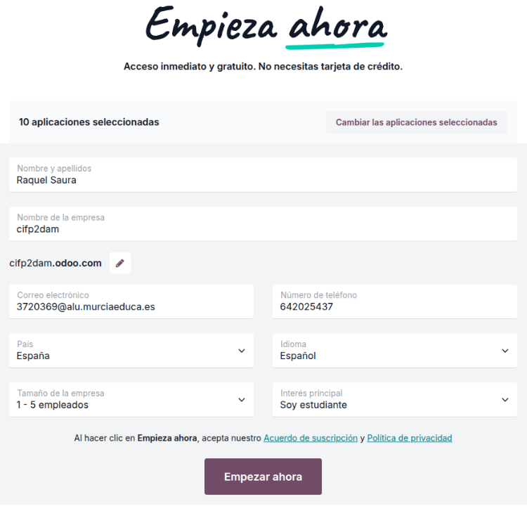
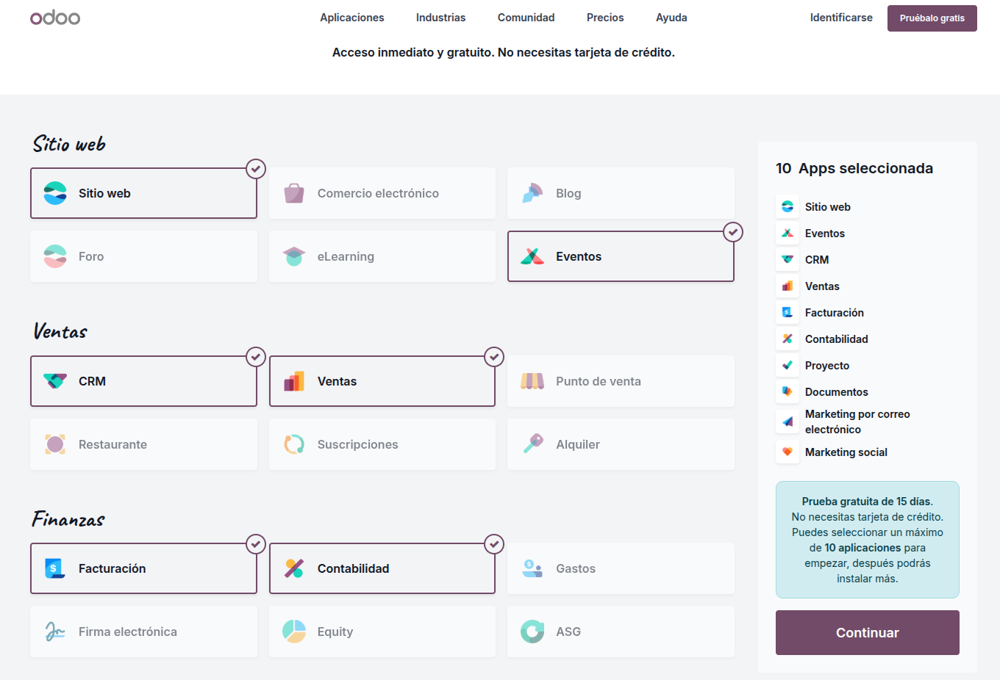

# 03 — Instalación y prueba (15 días) / Alta e instalación de apps

![[paso01_bienvenido_odoo.png]]
## Requisitos previos

- Navegador actualizado.
- Cuenta de correo para alta.

## Pasos

1. **Crear base de datos de prueba:**

	- Se inicia utilizando la opción de prueba gratuita.
	
	- El usuario puede probar la aplicación durante 15 días totalmente gratis.
	
	- Durante la instalación, para simplificar el proceso, se recomienda utilizar la opción estándar.

![[Odoo_Empieza-Ahora.png]]

2. **Seleccionar apps iniciales**:

	- Al comenzar la prueba gratuita, se deben seleccionar los módulos que desean (CRM, Ventas, Facturación, Contabilidad, Proyectos, Documentos, Calendario, etc.)
	
	- El máximo de aplicaciones que se pueden elegir para la prueba gratuita es de 10.

   

3. **Activación por Correo Electrónico:**

	- Una vez completada la configuración y seleccionadas las aplicaciones, se accede al panel principal, donde aparecerá un aviso de "activación pendiente".
	
	- Es muy importante activar la cuenta para confirmar la base de datos.
	
	- Si la cuenta no se confirma, la base de datos se borrará en 3 horas.
	
	- La activación se realiza haciendo clic en el enlace que hay en el correo de confirmación. Una vez confirmada, se obtiene acceso gratuito a la aplicación durante 15 días.

4. **Instalar/Desinstalar apps:**

	- La gestión de los módulos instalados se realiza yendo al menú de "Aplicaciones".
	
	- Para instalar un nuevo módulo (siempre que no se exceda el límite de la prueba gratuita), simplemente se hace clic en el botón de "Instalar" o "Activar".
	
	- Para desinstalar un módulo, se utiliza el menú de tres puntos (puntos suspensivos) asociado a la aplicación.
	
	- **CUIDADO** al desinstalar módulos, ya que si se desinstalan módulos que contienen datos (como el módulo de Contabilidad o una página web), se borrarán y **se perderán todos esos datos**.**

## Resultado esperado

 - Acceso al panel principal o dashboard.

- Visualización de todos los módulos o aplicaciones instaladas en el panel principal.

- La versión de prueba tendrá una fecha de expiración visible.

