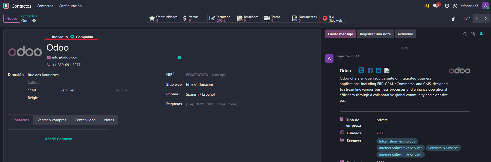
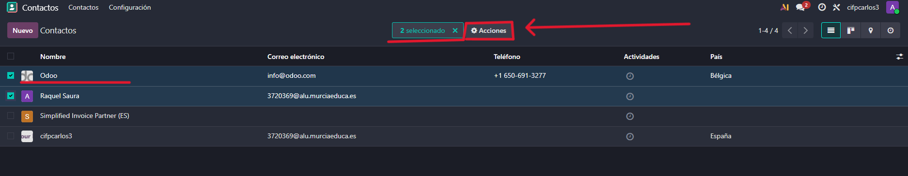
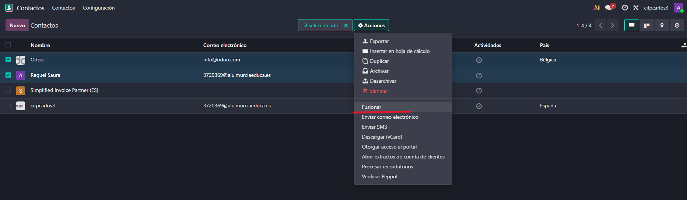
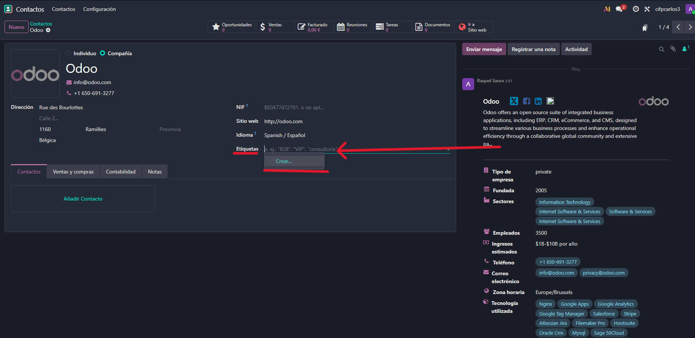
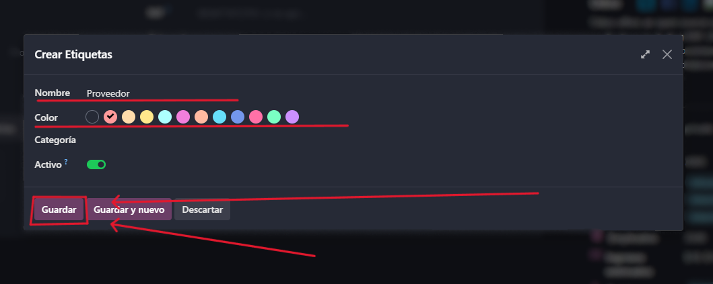
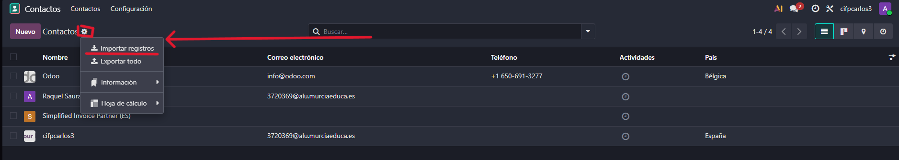

# 06 — Contactos

El módulo de Contactos es una de las aplicaciones fundamentales y comunes de Odoo. Este módulo es muy útil, ya que los registros que contiene pueden vincularse posteriormente al módulo de CRM, donde pueden convertirse en clientes y pasar a la gestión de presupuestos y facturación.

## Asociación automática persona/empresa.

Odoo posee una funcionalidad robusta para organizar los contactos y evitar duplicidades.

 **Diferenciación automática.** 
 
- La herramienta es capaz de reconocer automáticamente si un registro corresponde a una compañía o a un individuo.

- Cuando Odoo identifica a un individuo y a su compañía asociada (por ejemplo, ODU como compañía y ODU/Emilio como individuo), automáticamente asocia la persona dentro de la ficha de contacto de la empresa.

**Fusión (Opcional)** 

- Si el usuario detecta que los contactos están duplicados, es posible fusionar ambos contactos para crear un tercer registro definitivo, lo cual es útil si se desea consolidar información como números de teléfono o detalles específicos.

## Etiquetas para segmentar.

La creación de etiquetas asociadas a los contactos es una buena práctica que se recomienda adoptar desde el principio.

**Propósito.** 

- Las etiquetas se utilizan para segmentar la base de datos de contactos.

**Creación y Personalización.** 

- Las etiquetas pueden crearse directamente desde la ficha del contacto o a través de la configuración. 

- Es posible cambiar el color de las etiquetas para hacerlas más distintivas.

**Búsqueda.** 

- Utilizar etiquetas permite aprovechar al máximo la funcionalidad del buscador de Odoo, que es muy potente, permitiendo filtrar contactos por personas, compañías o por cualquiera de las etiquetas creadas.

## Importación CSV.

Una buena práctica inicial es importar la lista de contactos existentes, ya sea desde otro ERP o desde una lista.

**Proceso.** 

- La importación se inicia seleccionando la opción "Importar registros".

**Plantilla.** 

- Odoo permite descargar una plantilla que muestra cómo deben estar los contactos (separados por comas) y qué tipo de datos espera en cada columna.

**Formato.** 

- Es necesario seguir la plantilla para que los contactos sean reconocidos. El documento debe estar estructurado de manera que los datos se separen por comas.

