# 08 — Proyectos (Kanban)

## Pasos

- Proyectos, etapas, tareas, subtareas.
- Tareas recurrentes, dependencias, hitos.
- Vistas: tarjetas, lista, calendario propio.
- Registro rápido de actividades y **calificación del cliente**.

1. **Proyectos, etapas, tareas, subtareas**
 
	  **Proyectos.**
	
	- Los proyectos se visualizan inicialmente como tarjetas. 
	
	- Al crear un proyecto, se puede asociar si este será facturable o no, y vincularlo a un cliente ya guardado en el módulo de Contactos. Esto permite llevar un control de las horas para el cálculo de la facturación futura.
	
	
	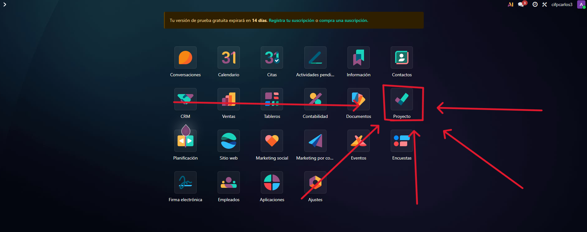

	
	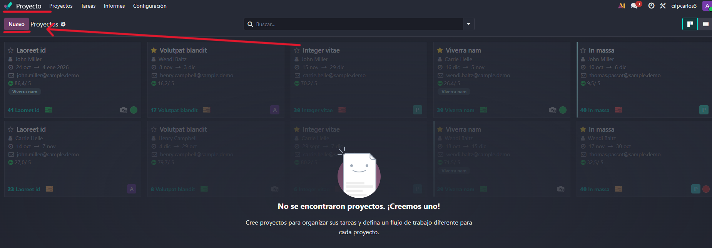

	
	
	
	
	**Etapas (Fases).** 
	
	- Odoo sugiere automáticamente las fases del proyecto que se van a controlar. Ejemplos de etapas incluyen "bandeja de entrada" (para tareas sin clasificar), "en progreso," "incidencias," y "hecho o finalizado". 
	
	- El usuario puede crear tantas etapas como desee, aunque se aconseja no complicarlo demasiado.
	
	
	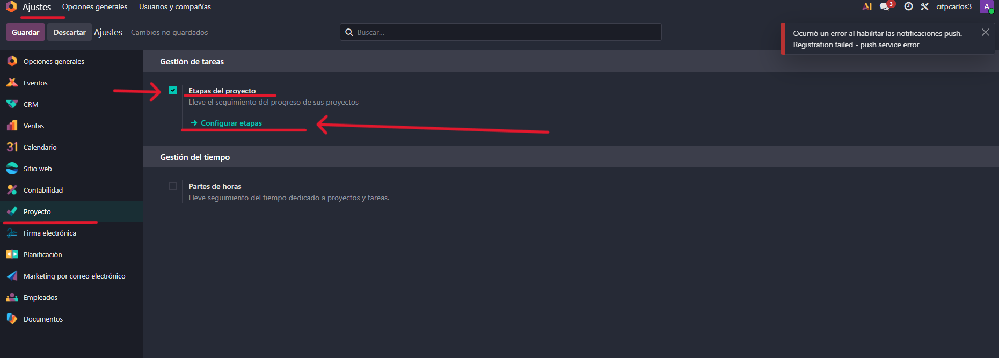

	
	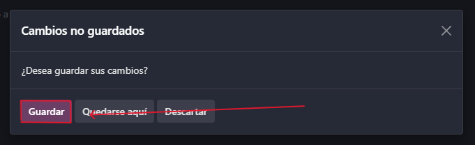
	
	
	**Tareas.** 
	
	- Las tareas se crean directamente dentro de una etapa. En la ficha de la tarea se puede añadir la descripción, etiquetas, el cliente asociado, la prioridad, y la fecha límite.
	
	
	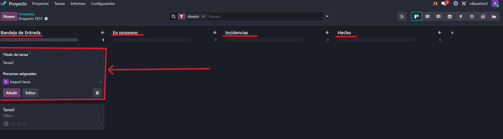

	
	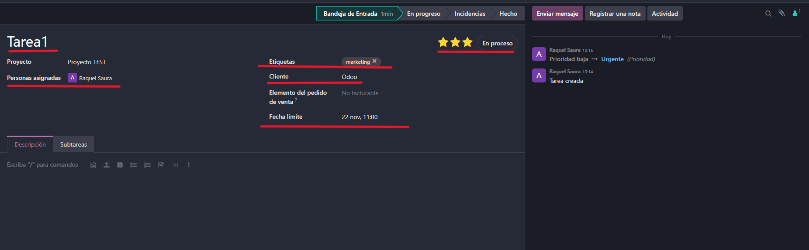
	
	
	**Subtareas.** 
	
	- Dentro de una tarea, se pueden crear subtareas. Esto ayuda a jerarquizar las prioridades. 
	
	- Es posible crear subtareas dentro de otras subtareas, aunque la fuente cuestiona la practicidad de una jerarquización "prácticamente infinita". 
	
	- Al añadir una subtarea, la tarjeta principal muestra un resumen del progreso (ej. "cero de una" hecha).
	
	
	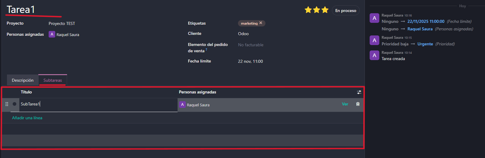

2. **Tareas recurrentes**, **dependencias**, **hitos**.

	**Tareas Recurrentes.** 
	
	- Esta funcionalidad debe activarse previamente en los ajustes del módulo. 
	
	- Una vez activa, se puede configurar una tarea para que se repita con una periodicidad definida (todas las semanas, todos los meses o todos los años), ya sea para siempre o hasta una fecha en concreto.
	
	
	**Dependencias.** 
	
	- Esta opción también requiere ser activada en los ajustes del proyecto. 
	
	- Permite establecer qué tareas deben completarse primero para poder iniciar otra. Una tarea puede marcarse como "bloqueado por"otras tareas, y mientras no se cumpla la condición, aparecerá en estado de "en espera".
	
	
	**Hitos.** 
	
	- La opción de "hitos" también se puede configurar en los ajustes del proyecto. 
	
	- La fuente señala que se pueden configurar, aunque sugiere que es posible utilizar las propias tareas para marcar hechos concretos, como el lanzamiento de una campaña o la creación de una página web.

3. **Vistas: tarjetas, lista, calendario propio.**

	**Tarjetas (Kanban).** 
	
	- Esta es la vista por defecto, similar a la de herramientas como Trello o Asana (modelo Kanban). 
	
	- La vista es muy visual, mostrando directamente en la tarjeta información relevante como el cliente, la etiqueta, el encargado, la prioridad y la fecha límite, sin necesidad de entrar al detalle de la tarea.
	
	
	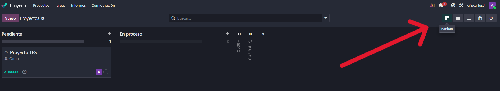
	
	
	**Lista.** 
	
	El módulo también ofrece la vista de listado. En esta vista, el usuario puede filtrar y añadir más campos de interés, como las etiquetas o la fecha planificada.
	
	
	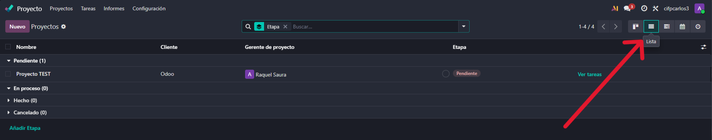
	
	
	**Calendario Propio.** 
	
	- El módulo de Proyectos tiene su propia visualización de **calendario**, distinta al Calendario general de Odoo. 
	
	- Desde esta vista, el usuario puede ver la visual de las tareas recurrentes, las tareas atrasadas, y las tareas pendientes, tanto las propias como las de los compañeros. La opción de Calendario del módulo de Proyectos calendariza los proyectos por separado.
	
	
	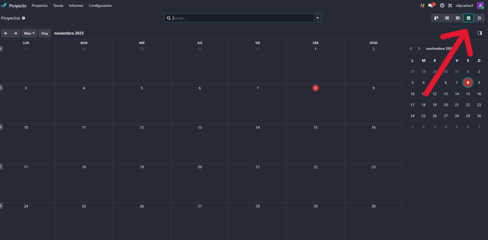

4. **Registro rápido de actividades y calificación del cliente**

	**Registro Rápido de Actividades.** 
	
	- Odoo incluye un icono  para programar actividades. Esto permite registrar rápidamente acciones como haber enviado un correo, agendado una llamada, o dejado una nota, sin tener que entrar a la tarjeta. Todo lo registrado se marca en el histórico de la tarea.
	
	
	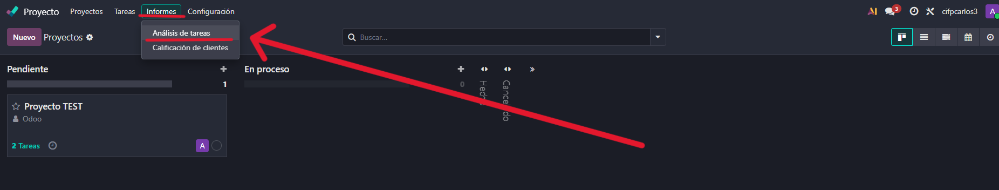

	
	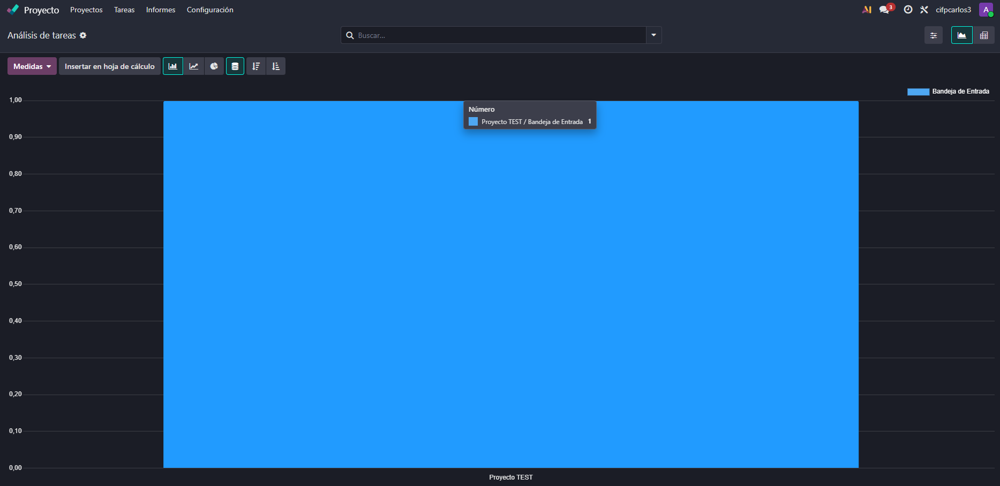
	
	
	
	**Calificación del Cliente (Rating).** 
	
	- Para utilizar esta función, debe activarse en `Configuración` > `Ajustes` en la sección de "Analítica". 
	
	- Al activarla, una vez entregado el proyecto, el cliente puede calificar cómo ha sido la entrega del proyecto. Esta información es de gran importancia para recibir feedback sobre la gestión, los tiempos de entrega y la calidad de los servicios, y puede consultarse en la sección de Informes y Análisis de las tareas
	
	
	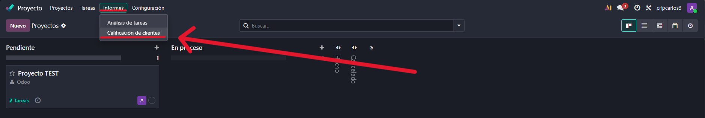

	
	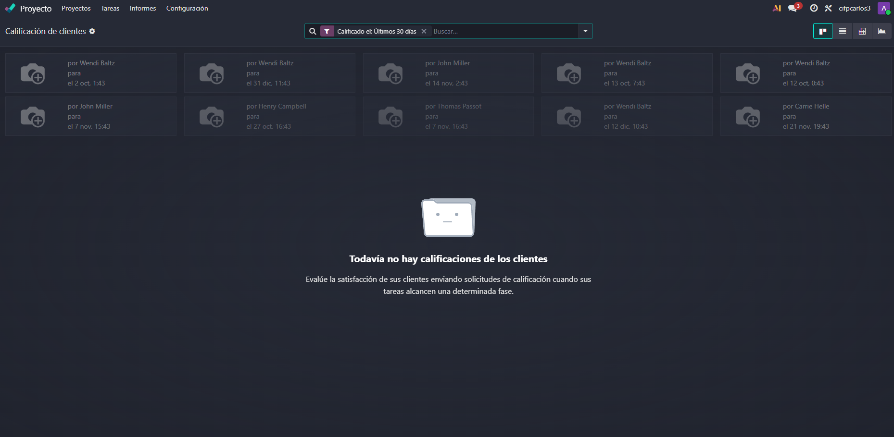

	
