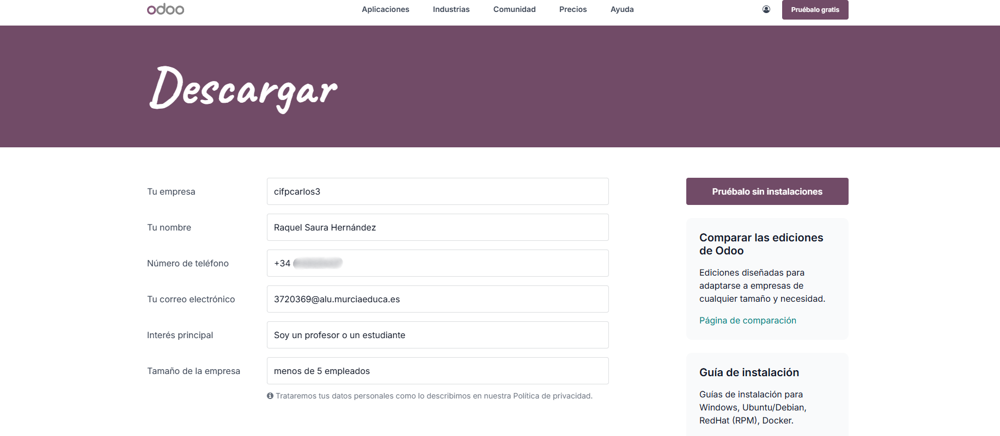
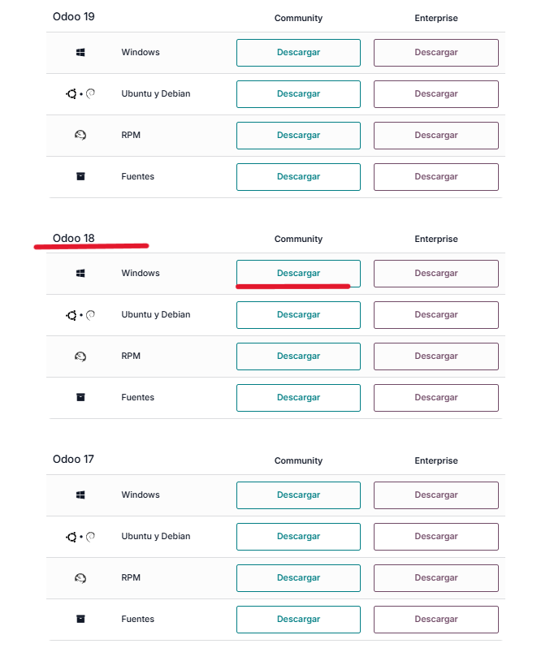

# 03 — Descarga del instalador de Odoo

1. Accede a la **web oficial de Odoo** y localiza el **instalador para Windows**.

	

   
2. Descarga la **versión estable** que vayas a usar en clase (anota la **versión exacta**).

	

> Resultado esperado: fichero `Odoo-<version>-setup.exe` en tu equipo.

