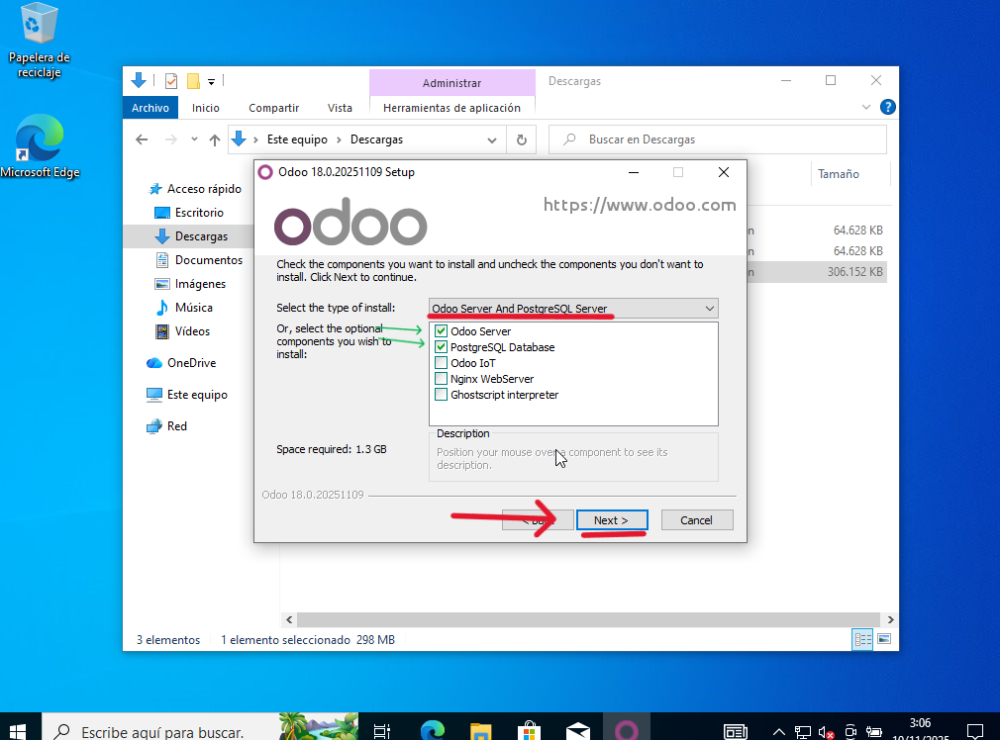
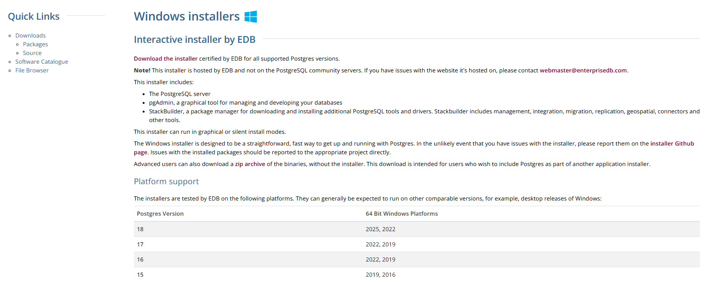
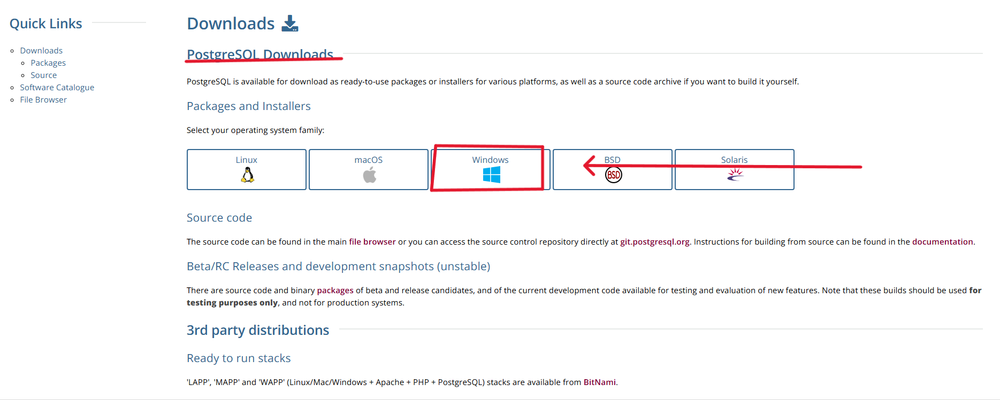
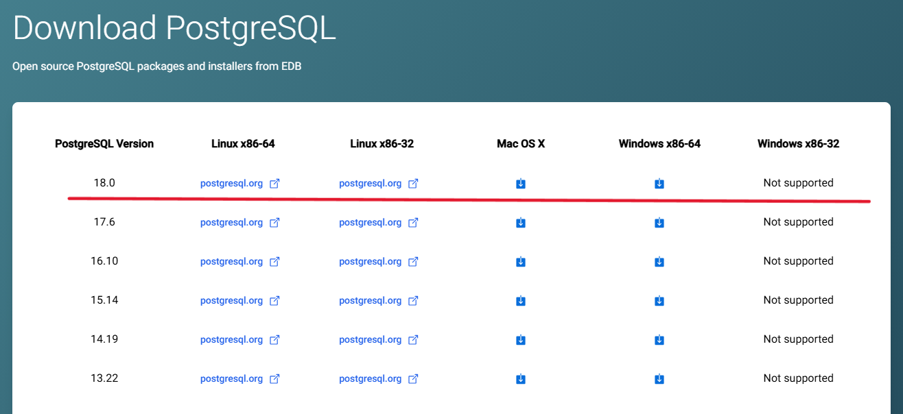

# 04 — PostgreSQL en Windows

> Odoo requiere **PostgreSQL**. Según instalador y versión, se incluye o puede requerir instalación separada.

1. Verifica si el instalador de Odoo **instala PostgreSQL** automáticamente.

	
	
	

2. Si no, descarga **PostgreSQL para Windows** e instálalo:
   - Selecciona versión soportada por tu Odoo.
   - Define usuario `postgres` y contraseña **segura** (anótala).

	

	
	

	
	

2. Comprueba que el **servicio de PostgreSQL** está en ejecución.

	

> Resultado esperado: PostgreSQL instalado y funcionando (usuario/puerto guardados).
