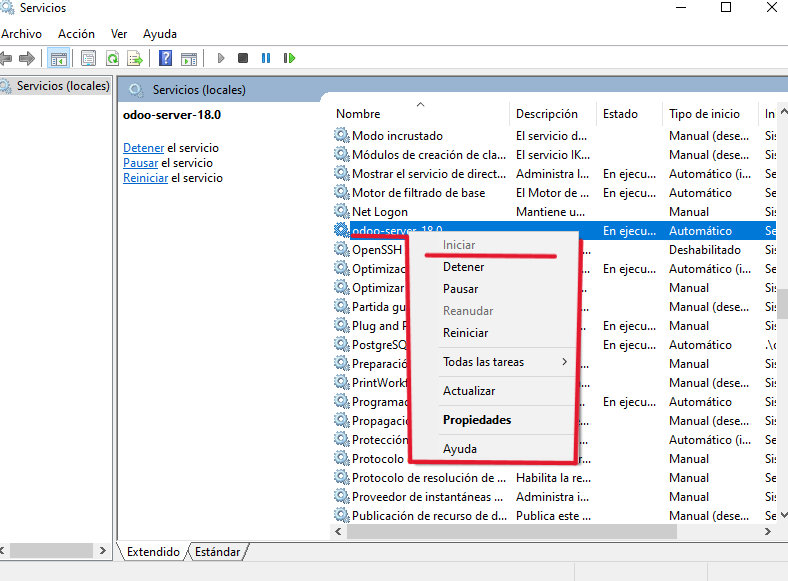
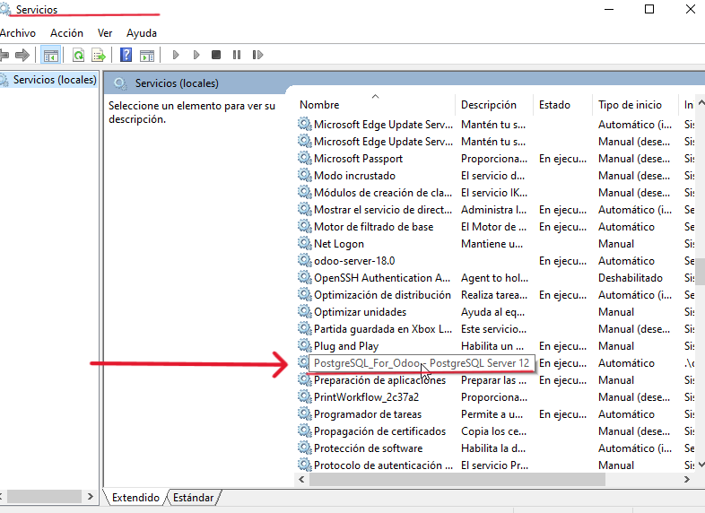

# 07 — Ejecución y servicio

1. Inicia Odoo mediante el **servicio de Windows** o acceso directo.

	

2. Verifica el estado del servicio (**Servicios** de Windows).
3. (Opcional) Revisa logs si no arranca correctamente.

	

	
	

> Resultado esperado: Odoo en ejecución local.
