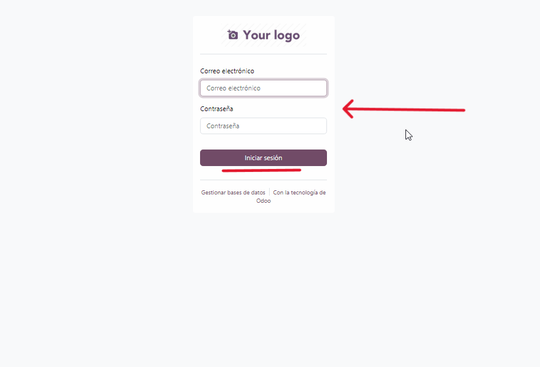
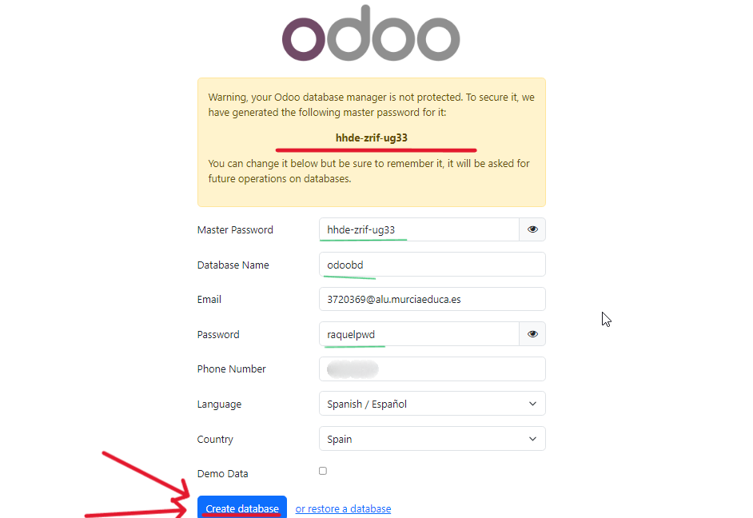
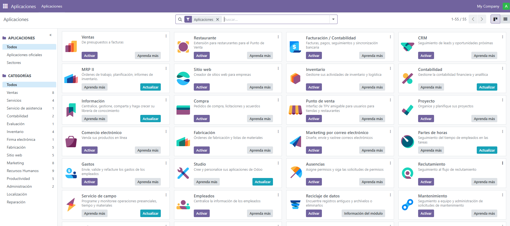

# 08 — Creación de base de datos de prueba

1. Accede a `http://localhost:8069` en tu navegador.

	

2. Crea una **base de datos nueva** (admin email y contraseña).

	

3. Elige módulos iniciales si procede.

	

> Resultado esperado: BD de prueba creada y primer acceso.
